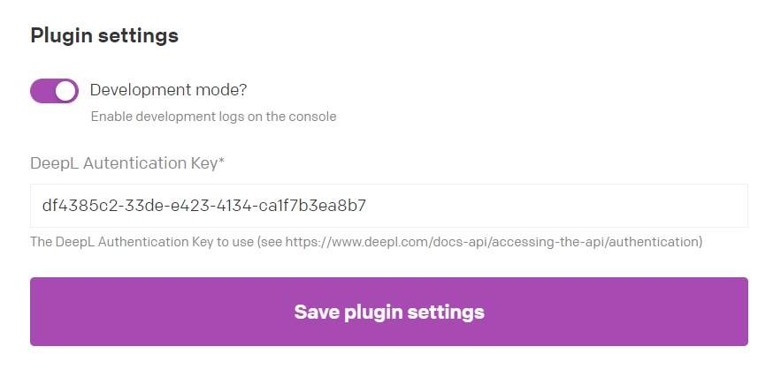

# DatoCMS DeepL Translate plugin for multilingual teams

Translate based on the defined original language of a datoCMS content item.

The plugin allows to translate your original content into all other languages with the help of deepL.

This plugin does not rely hard on the datoCMS "mainLocale" but on a field "original_language" to define the original language of a single content item.

To use it create a [dropdown field](https://www.datocms.com/docs/pro-tips/create-a-select-with-a-single-line-string-field) "original_language" in your content model containing your locales (for example "de,en,fr,it").

Then insert the plugin in the "field addon" section (in the tab "presentation") of your field. The new version of the plugin allows it to translate content inside modular block fields, simply insert the plugin to the content field inside your modular blocks.

## Configuration

Please specify your [DeepL API key](https://www.deepl.com/en/docs-api/) on the plugin global settings:

The plugin is based on the [DatoCMS Deepl plugin](https://github.com/daugsbi/datocms-plugin-deepl-translate),
and the [DatoCMS Yandex plugin](https://github.com/datocms/plugins/tree/master/yandex-translate).
